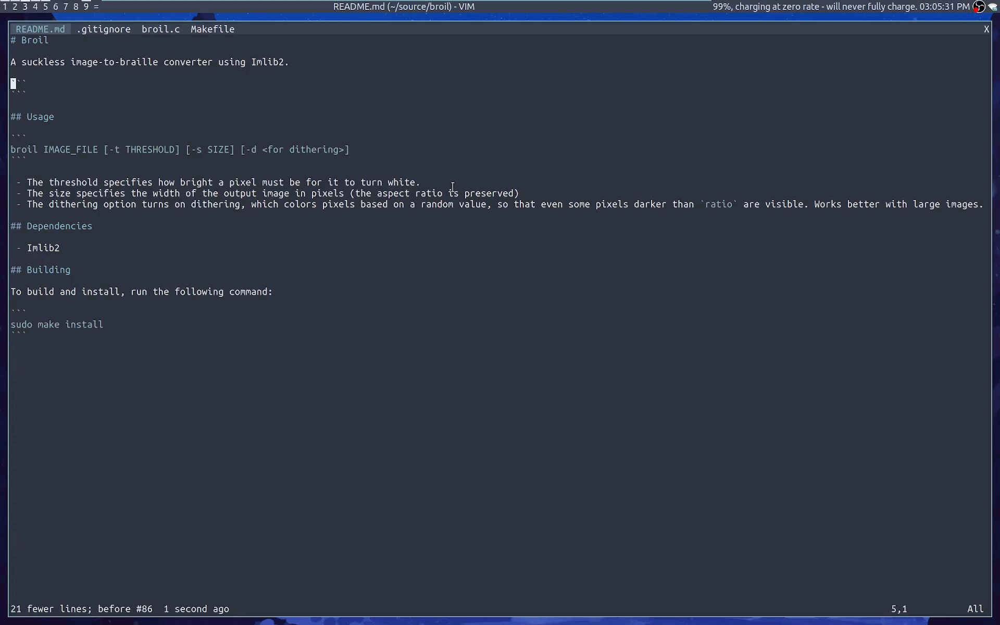

# Broil

A suckless image-to-braille converter using Imlib2.



## Usage

```
broil IMAGE_FILE [-t THRESHOLD] [-s SIZE] [-d <for dithering>]
```

 - The threshold specifies how bright a pixel must be for it to turn white.
 - The size specifies the width of the output image in pixels (the aspect ratio is preserved)
 - The dithering option turns on dithering, which colors pixels based on a random value, so that even some pixels darker than `ratio` are visible. Works better with large images.

## Dependencies

 - Imlib2

## Building

To build and install, run the following command:

```
sudo make install
```
